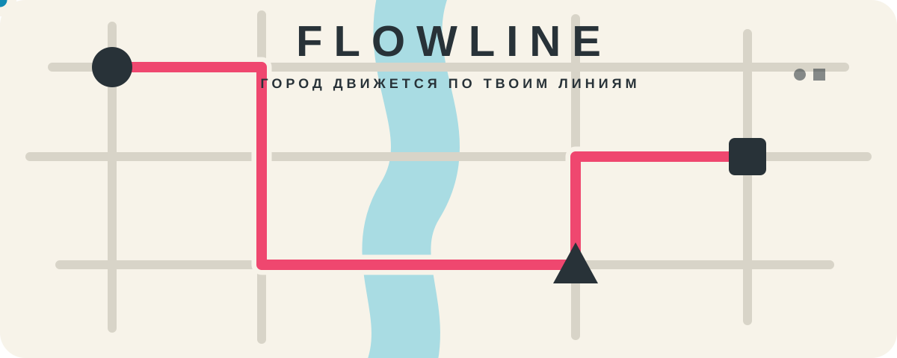
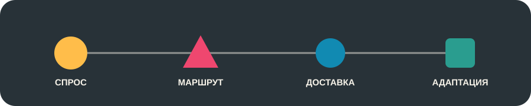

<div align="center">
  

  **Минималистичная стратегия о городе, который никогда не перестаёт хотеть есть.**

  `ANDROID` · `iOS` · `ИГРАЕТСЯ ОФЛАЙН` · `RU / EN`
</div>

---

## Город — это не фон. Это задача.

В **Flowline** рестораны готовят блюда, районы формируют спрос, а между ними лежит реальная уличная сеть: река, мосты, узкие улицы и маршруты, которые ещё предстоит придумать. Проведите линию, выпустите курьера и наблюдайте, как аккуратная схема превращается в живой городской организм.

Но город не ждёт. Начинается дождь. На мосту ремонт. Автомобиль застрял в внезапной пробке. Заказов становится больше — и одна неудачная линия может запустить цепную реакцию.

<div align="center"></div>

## 🚲 Постройте сеть, которая выдержит час пик

- **Рисуйте маршруты прямо по улицам.** Линии прилипают к дорожному графу и используют настоящие мосты.
- **Собирайте идеальный флот.** Пешие курьеры не боятся пробок, велосипеды манёвренны, автомобили быстры и вместительны.
- **Читайте город по фигурам.** Пицца, Азия, бургеры, десерты и здоровая еда имеют свой простой геометрический знак — никаких перегруженных меню.
- **Реагируйте, а не наблюдайте.** Пробки, ремонт, аварии, дождь и городские праздники меняют ритм партии.
- **Развивайтесь после доставок.** Выбирайте новую линию, курьера, паром или редкое улучшение дома.
- **Найдите свой ритм.** Пауза и ускорение ×2 доступны тогда, когда режим это разрешает.

## Четыре способа играть

| Режим | Для кого |
|:--|:--|
| **Обычный** | Чистая, напряжённая партия с честным ростом нагрузки |
| **Реализм** | Больше заказов, короче таймер перегруза и никакой паузы |
| **Бесконечный** | Сеть не закрывается — город восстанавливается и продолжает расти |
| **Песочница** | 6 линий и 24 курьера сразу: проектируйте без страха проиграть |

## Просто начать. Сложно удержать.

Игра открывается сразу на карте. Коснитесь ресторана, затем района — маршрут готов. Перетащите маркер курьера на цветную линию. Совпадающие фигуры подскажут, что и куда нужно доставить.

**Управление**

- `тап → тап` — построить оптимальный маршрут;
- `удержание + жест` — нарисовать линию вручную;
- `перетаскивание курьера` — назначить его на ближайшую линию;
- `щипок / свайп` — масштаб и перемещение карты;
- `тап по часам` — пауза, ×1 или ×2.

## Мир без спрайтов

Вся визуальная система создаётся на лету из линий, кругов, треугольников, цвета и движения. Дождь — десятки лёгких штрихов. Ремонт — ритм чёрно-жёлтой геометрии. Остывающее блюдо бледнеет и пульсирует. Даже иллюстрации в этом README — анимированные векторные фигуры, а не кадры или рендеры.

Звуковой мир работает так же минималистично: вместо бесконечного саундтрека короткие мелодичные сигналы складываются в уникальный ритм каждой партии.

## В дороге — даже без сети

Партия, рекорды и обучение хранятся на устройстве. Если свернуть игру, город будет восстановлен с теми же очередями, курьерами и событиями. Для игры интернет не требуется; он может понадобиться только для показа рекламы.

> Карта вдохновлена данными **© OpenStreetMap contributors** и подготовлена как компактный игровой район Rivergate.

### Диагностика геометрии карты

Debug-сборку можно запустить с `--dart-define=FLOWLINE_DEBUG_ROADS=true`. Поверх обычной карты будут отрисованы все рёбра и узлы дорожного графа без viewport-калтинга.

### Единая проекция координат

Все переводы `lat/lng → игровой мир` выполняет единственная утилита `lib/core/geo_projection.dart`
(`GeoProjection`). Для каждого города используется одна эквидистантная проекция вокруг фиксированного
центра `lat0/lng0`:

```
x = origin.dx + (lng - lng0) * cos(lat0) * scale
y = origin.dy + (lat0 - lat)             * scale
```

Масштаб `scale` одинаков по обеим осям, поэтому углы и форма дорог не искажаются. Эта же проекция
используется для отрисовки геометрии, для hit-testing/snap при рисовании линий и для расчётов
маршрутов — дублировать формулу в других файлах запрещено (есть тест, который это проверяет).

---

<div align="center">
  <b>Сколько доставок выдержит ваша сеть?</b><br/><br/>
  <sub>Flowline · портретная игра для Android 5.0+ и iOS 13+</sub>
</div>
